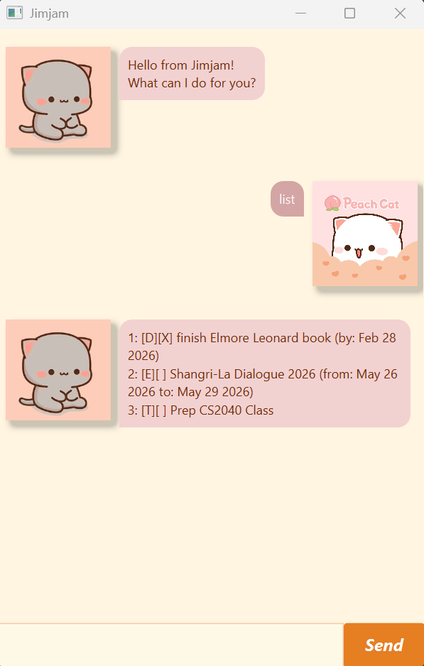

# Jimjam User Guide

Jimjam is a helpful chatbot tool that frees your mind of having to remember things you need to do.



## Table of Contents
* [Quick Start](#quick-start)
* [Features](#features)
    * [Adding Tasks](#adding-tasks)
    * [Managing Tasks](#tuning-your-list)
    * [Digging for Data](#digging-for-data)
* [Command Summary](#command-summary)

## Quick Start
1.  Ensure you have **Java 17** or above spinning on your machine.
2.  Download the latest `jimjam.jar` from our [releases page](https://github.com/jimjam-user/ip/releases).
3.  Open your terminal or double-click the jar to start the session.
4.  Type your command in the input bar and hit Enter. Jimjam will handle the rest.

## Features
> **Note:** Parameters in `<angle_brackets>` are mandatory.

### Adding Tasks

#### 1. Todo (`todo`)
For those simple tasks that just need to get done.
* **Format:** `todo <description>`
* **Example:** `todo Write song`

**Expected Output**:
```
Got it. I've added:
[T][ ] Write song
Now you have 1 task.
```
---

#### 2. Deadline (`deadline`)
For the tasks that have a hard cutoff.
* **Format:** `deadline <description> /by <yyyy-MM-dd`
* **Example:** `deadline Submit demo tape /by 2026-05-20`

**Expected Output**:
```
Got it. I've added:
[D][ ] Submit demo tape (by: May 20 2026)
Now you have 2 tasks.
```
---

#### 3. Event (`event`)
For the tasks that span a specific timeframe.
* **Format:** `event <description> /from <yyyy-MM-dd /to <yyyy-MM-dd>`
* **Example:** `event Jam Session /from 2026-06-12 /to 2026-06-12`

**Expected Output**:
```
Got it. I've added:
[E][ ] Jam Session (from: Jun 12 2026 to: Jun 12 2026)
Now you have 2 tasks.
```

### Managing Tasks

#### 4. List (`list`)
Displays all tasks currently stored in your list.
* **Format:** `list`
* **Example:** `list`

**Expected Output:**
```
Here are the tasks in your list:
1: [T][ ] Write song
2: [D][ ] Submit demo tape (by: May 20 2026)
3: E][ ] Jam Session (from: Jun 12 2026 to: Jun 12 2026)
```

